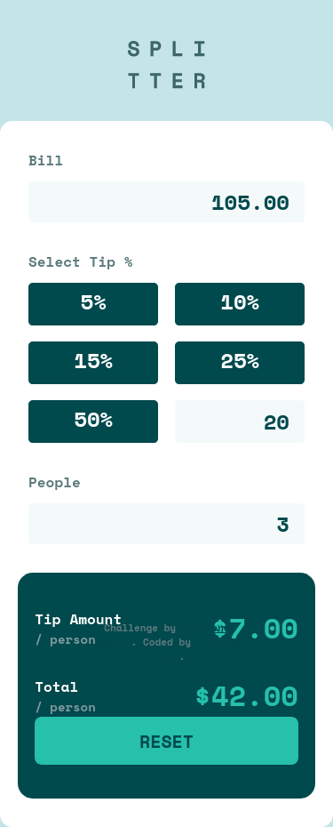
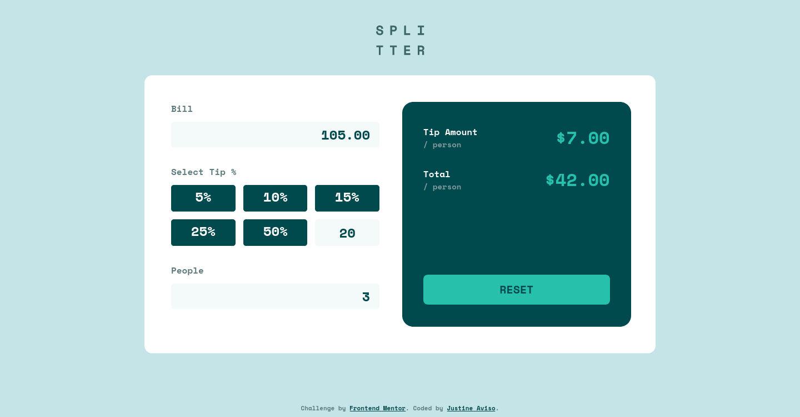

# Frontend Mentor - Tip calculator app solution

This is a solution to the [Tip calculator app challenge on Frontend Mentor](https://www.frontendmentor.io/challenges/tip-calculator-app-ugJNGbJUX). Frontend Mentor challenges help you improve your coding skills by building realistic projects.

## Table of contents

- [Overview](#overview)
  - [The challenge](#the-challenge)
  - [Screenshot](#screenshot)
  - [Links](#links)
- [My process](#my-process)
  - [Built with](#built-with)
  - [What I learned](#what-i-learned)
  - [Continued development](#continued-development)
- [Author](#author)

## Overview

### The challenge

Users should be able to:

- View the optimal layout for the app depending on their device's screen size
- See hover states for all interactive elements on the page
- Calculate the correct tip and total cost of the bill per person

### Screenshot

### Links

- Solution URL: [Add solution URL here](https://www.frontendmentor.io/solutions/react-js-wstyled-components-qOCVJFGeE)
- Live Site URL: [Add live site URL here](https://frontend-mentor-bill-splitter.netlify.app/)

## My process

### Built with

- Semantic HTML5 markup
- CSS custom properties
- Flexbox
- CSS Grid
- Mobile-first workflow
- [React](https://reactjs.org/) - JS library
- [Styled Components](https://styled-components.com/) - For styles

### What I Learned

I learned a lot in this project, expecially in using advanced concepts of styled components. In this project I also learn a lot about Providers and Hooks in React. 

### Continued development

I'ld like to become better and be more fammiliar with React and Styled Components. I also would like to know more about Grid, I only knew Flexbox and I think learning Grid would help me a lot as a developer

## Author

- Frontend Mentor - [@eta1389](https://www.frontendmentor.io/profile/eta1389)
- Facebook - [Justine Aviso](https://www.facebook.com/aviso.jstn)
